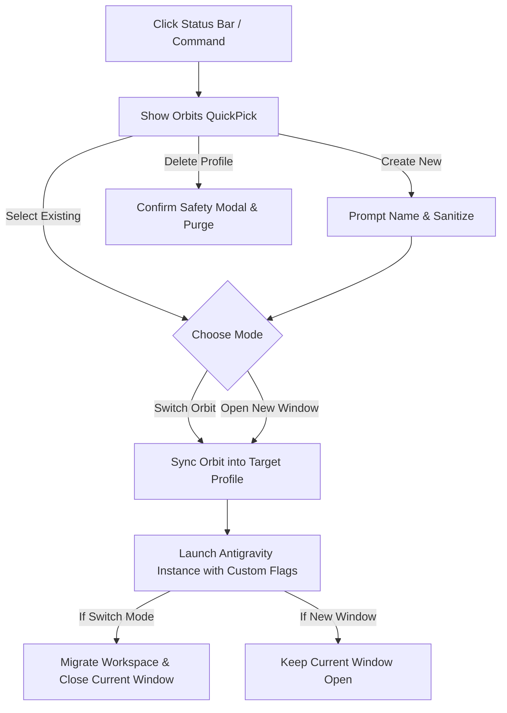

# 🪐 Orbit

<p align="center">
  
  
  
  
  
</p>

<p align="center">
  <b>Switch orbits in a single click.</b> Seamless, isolated developer profiles and sandboxed workspaces for <b>Google Antigravity IDE</b>.
</p>

---

## 🌟 Why Orbit?

By default, modern code editors share global extensions and settings across all projects. If you work across diverse technology stacks (e.g., *Web Development*, *Python AI/ML*, *Rust Systems*, *Cloud Infrastructure*, or *Blockchain*), this causes:
- 🐢 **Editor Bloat**: Dozens of background language servers and linters running simultaneously.
- ⚡ **Conflicting Toolchains**: Overlapping formatters, linters, and shortcut bindings fighting for control.
- 🧹 **Clutter**: Extension lists filled with tools irrelevant to your current task.

**Orbit** gives you clean, sandbox-isolated workspaces with instantaneous switching right from your status bar or command palette.

---

## ✨ Core Features

- **⚡ 1-Click Orbit Switcher**: Instantly switch profiles from the persistent bottom-left status bar item (`$(globe) Orbit: <Active>`) or Command Palette.
- **🔄 Seamless Auto-Restore on Launch**: When you open Antigravity IDE, Orbit automatically and silently restores your last used profile without extra clicks, delay, or UI flicker.
- **📦 100% Sandboxed Isolation**: Each profile possesses dedicated `--extensions-dir` and `--user-data-dir` stores. Settings, keymaps, global state, caches, and installed extensions never collide.
- **🔄 Auto Self-Propagating Engine**: When initializing or launching any profile, Orbit automatically synchronizes itself into the target profile's extension repository. You are never trapped inside a sub-profile without management controls!
- **🔀 Flexible Window Management**:
  - **🔄 Switch Orbit**: Seamlessly migrates your currently open workspace or project folder to the target profile and cleanly closes the previous window.
  - **🪟 Open in New Window**: Launches a standalone, isolated Antigravity IDE window alongside your current session without disrupting ongoing tasks.
- **🛡️ Built-in Security & Resilience**:
  - **Atomic Registry Writes**: Uses atomic temp-file replacement for `profiles.json` with restricted permissions (`0600`) to prevent metadata corruption or unauthorized access.
  - **Input Sanitization**: Protects against path traversal, prototype pollution (`Object.create(null)`), and Windows reserved device keywords (`CON`, `PRN`, `AUX`, `NUL`, etc.).
  - **Safe Process Spawning**: Spawns detached processes with `shell: false` and strict CLI argument validation to eliminate command injection vectors.
  - **Symlink Traversal Guards**: Profile deletion and recursive file synchronization strictly prevent directory traversal across symlinks.
- **🖥️ True Cross-Platform Support**: Works out of the box on **macOS** (Apple Silicon & Intel), **Windows** (x64/ARM), and **Linux** without any native compilation requirements.
- **🗂️ Zero External Dependencies**: 100% pure Node.js and VS Code / Antigravity IDE Extension API.

---

## 🚀 Quick Start & Usage

### 1. Switching Orbits
1. Click the orbit indicator in the bottom-left status bar: **`$(globe) Orbit: <Current>`**  
   *(or press <kbd>Cmd</kbd>/<kbd>Ctrl</kbd> + <kbd>Shift</kbd> + <kbd>P</kbd> and run `Orbit: Switch Profile`)*.
2. Select your desired profile from the QuickPick list (e.g. `Default`, `WebDev`, `PythonML`).
3. Choose your opening mode:
   - **`Switch to '<Profile>'`**: Migrates current project to the profile and closes current window.
   - **`Open in New Window`**: Launches an independent window running the target profile.

### 2. Creating a New Orbit
1. Trigger the orbit menu and choose **`$(plus) Create New Profile...`**  
   *(or run `Orbit: Create New Profile` from the Command Palette)*.
2. Type a clean profile name (e.g., `Rust-Dev`, `DataScience`, `ClientWork`).
3. Choose whether to immediately switch your active workspace or open in a new window.
4. Your new isolated profile directory will be created, initialized, and opened immediately!

### 3. Deleting an Orbit
1. Open the orbit menu (`Orbit: Switch Profile`).
2. Select **`$(trash) Delete a Profile...`** in the *Manage Profiles* section.
3. Choose the profile to remove and confirm the safety modal prompt. The directory and registry entry will be cleanly purged.

---

## ⚙️ Extension Settings

| Setting | Type | Default | Description |
|---|---|---|---|
| `antigravity-orbit.autoRestoreLastProfile` | `boolean` | `true` | When `true`, automatically and seamlessly launches your last active orbit profile on IDE startup instead of the Default profile. |

---

## ⌨️ Command Reference

| Command | Command Identifier | Description |
|---|---|---|
| **Orbit: Switch Profile** | `antigravity-orbit.switch` | Opens the QuickPick menu showing active orbit, available profiles, and management options. |
| **Orbit: Create New Profile** | `antigravity-orbit.create` | Prompts for a profile name and launches the new isolated environment immediately. |
| **Orbit: Open Profiles Folder** | `antigravity-orbit.openFolder` | Opens the central profiles directory (`~/.antigravity-custom-profiles`) in Finder / File Explorer. |

---

## 📂 Storage Architecture

All custom profile files and settings are centrally isolated under your user home directory:

```text
~/.antigravity-custom-profiles/
├── profiles.json                       # Central shared metadata registry (atomic writes, 0600)
│
├── WebDev/                             # Example: Web Development Profile
│   ├── extensions/                     # Isolated extension storage
│   │   └── sajedulisakib-001.antigravity-orbit-1.0.2/  # Auto-synced Orbit extension
│   └── user-data/                      # Isolated settings, keybindings & storage
│
└── PythonML/                           # Example: AI/ML Profile
    ├── extensions/                     # Dedicated extensions (e.g. PyTorch, Jupyter)
    └── user-data/                      # Dedicated settings & Python toolpaths
```

### CLI Flag Execution Under the Hood
When launching an isolated instance, Orbit invokes the Antigravity binary with dedicated directory parameters:
```bash
antigravity-ide \
  --extensions-dir "~/.antigravity-custom-profiles/<ProfileName>/extensions" \
  --user-data-dir "~/.antigravity-custom-profiles/<ProfileName>/user-data" \
  -n [workspacePath]
```

---

## 📦 Installation

### Option A: VS Marketplace Installation (Recommended)
Search for **`Orbit - Antigravity Profiles`** (or `sajedulisakib-001.antigravity-orbit`) in the Extensions tab (<kbd>Cmd</kbd>/<kbd>Ctrl</kbd> + <kbd>Shift</kbd> + <kbd>X</kbd>) and click **Install**.

### Option B: Manual Installation
1. Clone or copy the `antigravity-profiles` folder into your Antigravity IDE extensions directory:
   - **macOS / Linux**:
     ```bash
     mkdir -p ~/.antigravity-ide/extensions/
     cp -r /path/to/antigravity-profiles ~/.antigravity-ide/extensions/sajedulisakib-001.antigravity-orbit-1.0.2
     ```
   - **Windows (PowerShell)**:
     ```powershell
     New-Item -ItemType Directory -Force -Path "$env:USERPROFILE\.antigravity-ide\extensions\"
     Copy-Item -Recurse -Force "path\to\antigravity-profiles" "$env:USERPROFILE\.antigravity-ide\extensions\sajedulisakib-001.antigravity-orbit-1.0.2"
     ```
2. In Antigravity IDE, press <kbd>Cmd</kbd>/<kbd>Ctrl</kbd> + <kbd>Shift</kbd> + <kbd>P</kbd> and run **`Developer: Reload Window`**.
3. Look at the bottom-left status bar — you'll see **`$(globe) Orbit: Default`** ready to use!

---

## ⚙️ How It Works



1. **Active Profile Resolution**: On startup, Orbit checks process arguments and extension directory paths to determine which profile is currently executing in the active window.
2. **Self-Propagation**: Before launching a custom profile, Orbit copies itself into the destination's `extensions/` folder (skipping symlinks, `.git`, and `node_modules`).
3. **Detached Process Execution**: Antigravity IDE is launched asynchronously in a detached child process with clean IPC hooks and hardened path validation.

---

## ❓ Frequently Asked Questions (FAQ)

<details>
<summary><b>Will installing extensions in a custom profile affect my default profile?</b></summary>
<p>No. Each custom orbit profile has a completely separate <code>extensions/</code> directory. Extensions installed in one profile will not appear in or slow down any other profile.</p>
</details>

<details>
<summary><b>Where are my profile-specific settings stored?</b></summary>
<p>Inside <code>~/.antigravity-custom-profiles/&lt;ProfileName&gt;/user-data/User/settings.json</code>. You can customize themes, fonts, telemetry, keybindings, and editor settings individually for every profile.</p>
</details>

<details>
<summary><b>Can I switch back to the Default profile easily?</b></summary>
<p>Yes! The <code>Default Profile</code> option is always pinned at the top of the Orbit Switcher menu. Selecting it will return you to your global Antigravity configuration.</p>
</details>

<details>
<summary><b>How does auto-restoring the last profile work on startup?</b></summary>
<p>When you launch Antigravity IDE from your dock or desktop, Orbit instantly detects your last active profile in <code>profiles.json</code> and transitions to it in the background without popups or delay. If you prefer to always open the Default profile on startup, set <code>"antigravity-orbit.autoRestoreLastProfile": false</code> in your settings.</p>
</details>

<details>
<summary><b>How does profile deletion ensure safety?</b></summary>
<p>Profile deletion performs strict canonical path validation and symlink checks to ensure targets reside strictly within <code>~/.antigravity-custom-profiles/</code>. It also requires explicit modal confirmation and will warn you if you attempt to delete the profile currently active in your window.</p>
</details>

---

## 🤝 Contributing

Contributions, feature requests, and issue reports are warmly welcome!
1. Fork the repository
2. Create a feature branch (`git checkout -b feature/amazing-feature`)
3. Commit your changes (`git commit -m 'Add amazing feature'`)
4. Push to the branch (`git push origin feature/amazing-feature`)
5. Open a Pull Request

---

## 📄 License

Distributed under the **MIT License**. See `LICENSE` for details.
